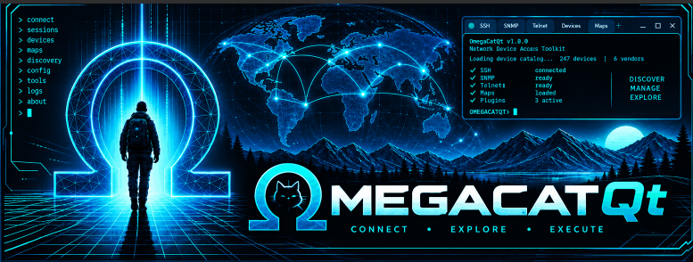
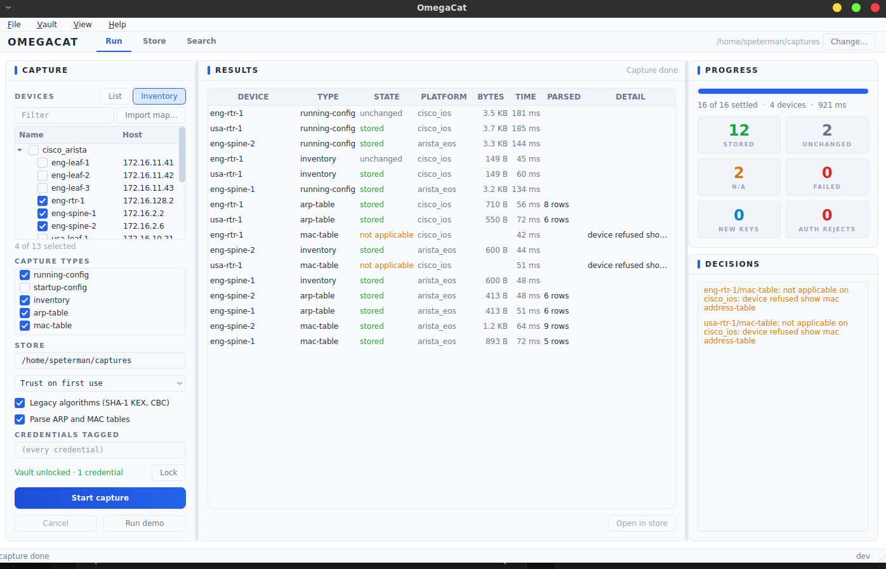
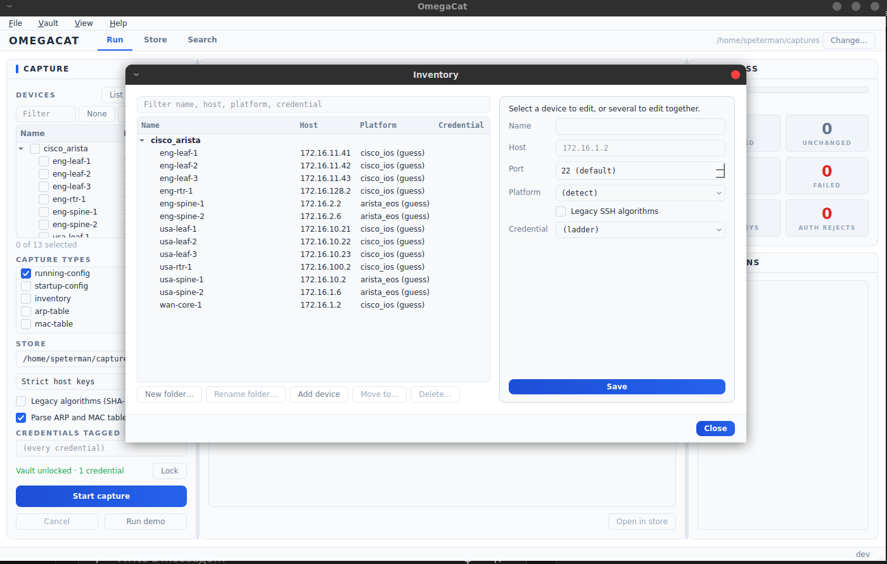
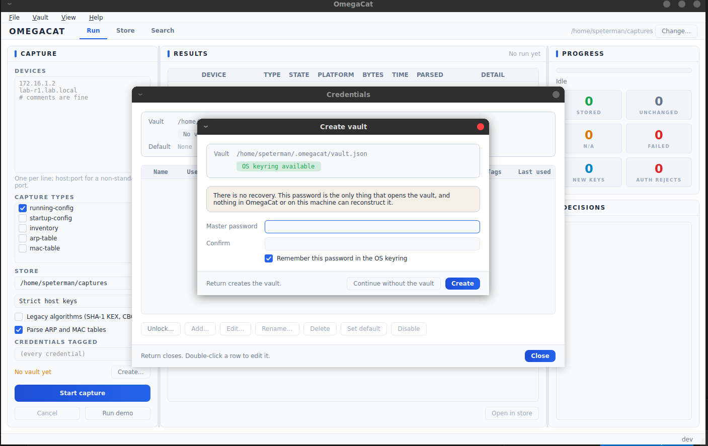
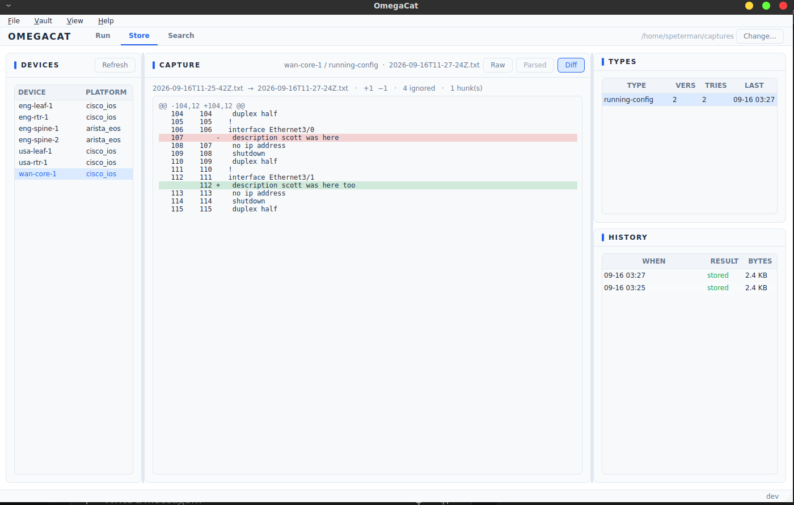
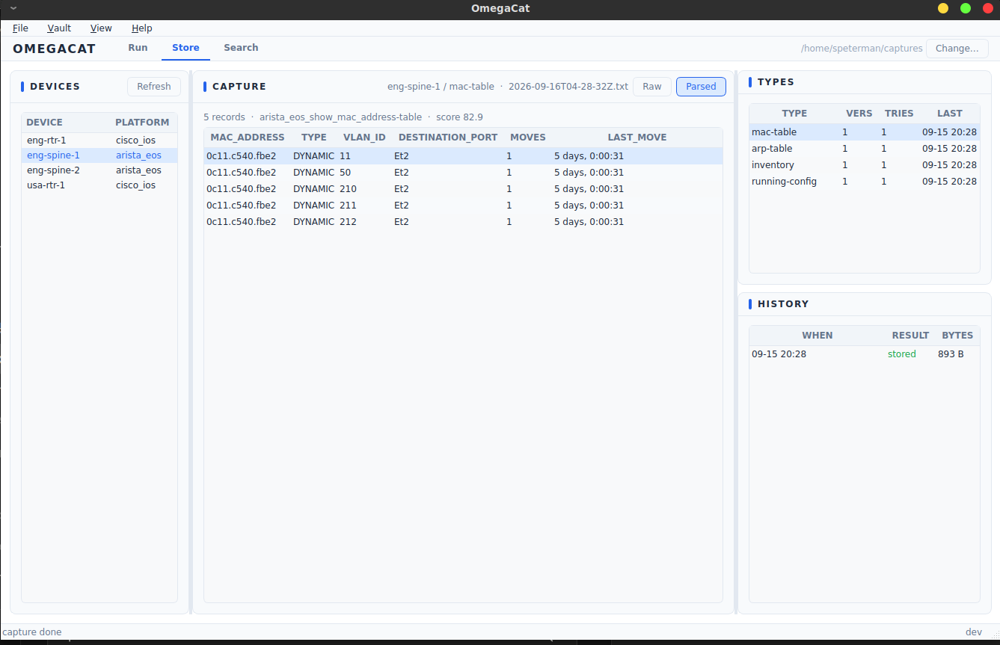

# OmegaCatQt

Read-only configuration and state capture for network devices: an inventory
you manage, captures over SSH into a local store that keeps history, parsed ARP
and MAC tables, version diffs of configs, and search across everything stored.
Self-hosted, no external services. Go core, C ABI, Qt application -- the
capture, store and search side of PathfinderSSH, rebuilt on the Omega stack and
independent of it.



## What it does


### Devices and inventory

- **Two ways to name devices.** The Run view's Devices field is a typed list
  (one per line, `host:port` for a non-standard port, `#` comments) or the
  inventory, `~/.omegacat/inventory.yaml`, shown as a folder tree with a filter,
  tick boxes and a count. With a filter active, ticking a folder ticks only the
  devices shown, and the count warns when ticked devices are hidden.
- **Import from omegamaps.** *File → Import omegamaps map.json…* copies a crawl's
  devices into a folder named after the crawl: SSH, addressed by the crawl's IP,
  named by the map, leaves left out. The map's platform is kept as `device_type`,
  a guess. The map is not read again. Re-importing recognises a device by its
  address anywhere or its name in that folder, adds only new ones, and changes
  nothing on a known device except `device_type` -- so an address, name,
  platform, legacy or credential edited by hand survives the next crawl.
- **Inventory manager.** *File → Manage inventory…*, or *Edit…* on a device in
  the Run view. One device: name, host, port, platform, legacy SSH algorithms,
  credential. Several at once: platform, legacy and credential, each left
  *(unchanged)* unless touched. New, rename and delete folders; add, move and
  delete devices. Every action is written in one step or not at all, addresses
  stay unique, and ticks in the Run view follow a device whose address changed.
- **Exact selection.** Ticked devices are captured by `transport:host:port`, so
  devices port-forwarded behind one address stay separate.

### Capturing

- **Types:** `running-config`, `startup-config`, `inventory`, `arp-table`,
  `mac-table`, with commands across `cisco_ios`, `cisco_iosxe`, `cisco_nxos`,
  `arista_eos`, `juniper_junos`, `aruba_cx`, `aruba_procurve`, `hp_comware` and
  `extreme_exos` (not every type on every platform; `capture -list-types` shows
  the table). A type a platform has no command for, or that the device
  refuses, is *not applicable* rather than a failure. One login per device
  however many types, and nothing but the fingerprint probes and the types'
  show commands is sent.
- **Platform.** Detected by fingerprinting unless a platform is set on the
  device, in which case the set platform is used -- that platform's paging is
  still disabled -- and a disagreeing device is noted in Decisions. The map's
  `device_type` is only compared: a mismatch, or a device that could not be
  detected, is noted too.

  
- **Credentials.** An encrypted vault (`~/.omegacat/vault.json`, unlocked from
  the OS keyring when available) holding password, key, keyboard-interactive and
  agent credentials with tags, priority, a default and a disable switch, managed
  from *Vault → Manage credentials…*. Capture walks the credentials in order,
  stops on failures no other credential would fix, and remembers what worked per
  device. A device can name its own credential; tags narrow the set per run.
- **SSH.** Strict host keys or trust on first use with known keys recorded;
  legacy SHA-1 key exchange and CBC ciphers for the whole run or per device;
  jump host (CLI).
- **Identity.** A device is filed under the name its own prompt gives on first
  contact, and bindings beside the vault keep later captures -- by address, by
  name, through a port-forward -- under that one name.
- **The Run view** shows a row per device and type as it happens (state,
  platform, bytes, time, parsed rows), counters, and a Decisions list of what
  is worth reading: failures, not-applicable types, new host keys, naming and
  platform notes. *Run demo* plays a scripted run with nothing contacted.

### The store

- **Layout.** `<store>/devices/<name>/<type>/`: one file per distinct version,
  `history.jsonl` recording every attempt, and `device.json`. A capture
  identical to the last stored one writes no file and is recorded as unchanged.
  ARP and MAC tables keep the last 5 versions; configs and inventory keep all.
- **Parsed tables.** ARP and MAC tables are parsed at capture time by a Go port
  of tfsm-fire into a `.parsed.json` beside the file (template, score, records).
  The template database ships in the build and is copied to
  `~/.omegacat/tfsm_templates.db` on first use.
- **Store view.** Devices, their types (versions, attempts, last), history, and
  each version as **Raw**, **Parsed** (a table) or **Diff**.
  
- **Diff.** For `running-config`, `startup-config` and `inventory`: a version
  against the one before it, or any two selected in History, with line numbers
  and context. Lines that change only because something else did (IOS
  `Current configuration : N bytes`, `! Last configuration change at`) are
  shown dimmed and not counted, by per-platform rules in
  `~/.omegacat/diff-ignore.yaml` -- written with defaults on first use, re-read
  on every diff, display only. ARP and MAC tables are not line diffed.

  

- **Search view.** Literal search across the current version of every capture,
  optionally case-sensitive and limited to types; a hit opens its file at the
  line.

### Application

Light, Dark and Cyber themes; the store is chosen from the header or
*File → Open store…*, and a store typed into the Run form is opened when a
capture starts.

## Lineage

| Packages | From |
|---|---|
| sshcore, dial, credres, netexec, normalize, vault, vaultcli, secfile, buildinfo, fakedev, topo | omegamapsqt |
| capture, capturerun, capturedial, storesearch, sessions, cmd/capture | pathfinderssh |
| cmd/ocvault | omegamapsqt `cmd/omvault` |

Changes from those sources:

- `credres`: the deprecated `Config.Emit` is gone (`Observer` replaced it);
  `Method` is defined in `credres`, so `crawlrun` is not in the tree.
- `netexec`: `expect` matches the prompt against a normalized tail of the
  buffer instead of re-normalizing the whole buffer on every read. 4 MiB in
  4 KB reads went from ~10.6 s to ~20 ms. The same fix applies to omegamaps.
- `capture`: running-config and startup-config carry `ConfigMaxBytes`
  (16 MiB, shared with search's file limit) instead of netexec's 4 MiB default.
- `capturerun`: a sequence model (`RowsSince`, `DecisionsSince`, `Progress`)
  for views that pull, as omegamaps' `crawlrun` has.
- Parsing: ARP and MAC tables are parsed at capture time with a Go port of
  tfsm-fire (`internal/tfsmfire`) into a `.parsed.json` beside the stored
  file. The template database ships in the build and is copied to
  `~/.omegacat/tfsm_templates.db` on first use; `-no-parse` and `-templates`
  control it.
- Device identity: a device reached through a vault is named from its prompt
  on first contact rather than filed under the address it was dialed by, and
  devices behind port-forwards on one host (`127.0.0.1:2201`, `:2202`) stay
  separate devices.
- `vaultcli` / `ocvault`: `~/.omegacat`, keyring service `omegacat`,
  `OMEGACAT_VAULT_PASSWORD`, `OMEGACAT_NO_KEYRING`. `ocvault add` refuses SNMP
  credentials; an omegamaps vault can be opened with `-vault` on purpose.

## Build

```sh
./scripts/build.sh            # vet, race tests, tools, c-archive, capi_probe
./scripts/build.sh --no-capi  # tools only, no C toolchain
```

Tools only, by hand (pure Go, cross-compiles):

```sh
go build -trimpath -o bin/ ./cmd/capture ./cmd/ocvault
```

The C surface by hand:

```sh
cmake -S . -B build/cmake && cmake --build build/cmake
ctest --test-dir build/cmake --output-on-failure
```

The Qt application (finds Qt, configures, builds, and reports which Qt the
binary loads):

```sh
./scripts/build-app.sh              # build/cmake/app/omegacat(.app)
./scripts/build-app.sh --probe      # and run capi_probe and app_probe
./scripts/build-app.sh --list       # every Qt found, in the order tried
```

`omegacat --demo 40` plays a scripted run through the window with nothing
contacted.

On Windows, `scripts\build.bat` builds and tests the tools; the C surface and
the application need the MinGW/MSVC toolchain omegamaps uses, not yet scripted
here.

## Use

The application: `omegacat` (see Build). The CLI:

```sh
ocvault init
ocvault add -name lab-key -user admin -key ~/.ssh/id_ed25519 -tag lab -priority 10

# a device list
capture -device-file devices.txt -vault ~/.omegacat/vault.json -cred-tag lab \
        -store ~/captures -type running-config -type inventory

# from the inventory
capture -sessions ~/.omegacat/inventory.yaml -match 'eng-*' -vault ~/.omegacat/vault.json \
        -store ~/captures -type running-config
```

Other flags: `-tofu` and `-known-hosts`, `-legacy`, `-jump`/`-jump-key`,
`-concurrency`/`-expensive-concurrency`, `-timeout`, `-no-parse`/`-templates`,
`-list-types`, `-dry-run`.

### Files

| Path | What |
|---|---|
| `~/.omegacat/vault.json` | credentials, encrypted; `vault.bindings.json` beside it |
| `~/.omegacat/inventory.yaml` | the inventory (session-file format) |
| `~/.omegacat/tfsm_templates.db` | parse templates, copied from the build |
| `~/.omegacat/diff-ignore.yaml` | diff ignore rules per platform |
| `~/.ssh/known_hosts` | host keys (shared with OpenSSH; `-known-hosts` to use another) |
| `~/captures` | the default store |

## C surface

| Header | What |
|---|---|
| `omegacat/omegacat.h` | runs: live capture and demo, notifier, progress / rows / decisions pulled by sequence |
| `omegacat/store.h` | browse a store with no run: devices, types, history, read, parsed tables, diffs |
| `omegacat/search.h` | literal search across a store's current captures |
| `omegacat/inventory.h` | the inventory: load, import omegamaps `map.json`, atomic edits |
| `omegacat/vault.h` | credentials; metadata out, secrets only in |

Built as a Go c-archive, the same model as omegamaps: handles, JSON results,
and a notifier the Qt side watches with `QSocketNotifier` instead of callbacks.

## Next steps

1. **Platform list order.** The platform picker in the inventory manager lists
   platforms in fingerprint-probe order; sort them, with *(detect)* first.
2. **Detected platform in the inventory manager.** Show the platform capture
   last detected (from the store's `device.json`) beside the map's guess and any
   platform set by hand.
3. **Template Lab.** A self-service tool for the parse templates: test a
   template against stored output, see candidates and scores, edit and save into
   `~/.omegacat/tfsm_templates.db`. Reliable parses are also what a semantic
   diff of ARP and MAC tables will need.
4. **Settings dialog.** Edit what is configurable today in files: diff ignore
   rules, the template database location, and defaults such as the store.

### Field kit: alignment across the Omega suite

OmegaCat is meant to be a consultant's discovery kit alongside Omega SSH and
omegamaps. The three share their roots -- vault, credential resolution,
sessions, SSH -- so these belong to the suite, done once and kept aligned
rather than solved three ways.

5. **Workspaces.** One directory per engagement holding its vault, bindings,
   inventory, host keys and store, chosen from the File menu, so one client's
   credentials and devices never sit beside another's and closing an engagement
   is one deletion. Stores are already per directory; the rest follows a chosen
   root instead of `~/.omegacat`.
6. **Windows.** Client laptops are usually Windows, often without admin rights.
   Script the C surface and application build, and check the application runs
   from a folder without an installer.
7. **Report export.** The deliverable from a discovery week: a device list with
   platforms and versions, inventory and serials, a config archive, and ARP and
   MAC tables as CSV, built from what the store already holds.

Also not done: the inventory manager moves devices with *Move to…* only (no drag and
drop), and diff ignore rules affect display, not whether a capture is stored.

## Building in a Claude sandbox

`docs/README_Claude_sandbox.md`: the toolchain, the module-proxy workaround
(`scripts/sandbox-modfile.sh`), the probes and their screenshots, template
parity against the Python engine, and what the sandbox cannot prove.

## Before pushing

```sh
scripts/scrub-check.sh
```

Fails on anything in a private denylist kept outside the repo
(`$OMEGACAT_DENYLIST`, default `~/.config/omegacat/denylist`): one extended
regex per line, case-insensitive. Examples and tests use lab names only.

## Licence

Copyright (C) 2026 Scott Peterman.

OmegaCat is free software: you may redistribute it and modify it under the
terms of the GNU General Public License version 3, as published by the Free
Software Foundation. It is distributed in the hope that it will be useful, but
WITHOUT ANY WARRANTY -- without even the implied warranty of MERCHANTABILITY or
FITNESS FOR A PARTICULAR PURPOSE. See [LICENSE](LICENSE) for the full text, and
[licenses/THIRD_PARTY_NOTICES.md](licenses/THIRD_PARTY_NOTICES.md) for the
components it incorporates. Qt is used under the LGPLv3, dynamically linked and
unmodified. The same notices and licence texts are compiled into the
application: Help → Attributions.
